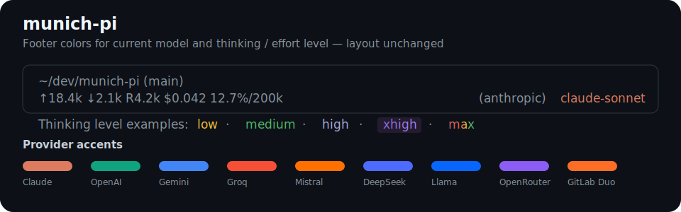

# munich-pi

A Git-installable collection of Pi extensions and resources.

Currently includes one extension package: `model-effort-colors`.

## Installation

From GitHub:

```bash
pi install git:github.com/<user>/munich-pi
```

From GitLab or another Git URL:

```bash
pi install https://gitlab.com/<user>/munich-pi
```

From a local checkout:

```bash
pi install /absolute/path/to/munich-pi
```

Then restart your Pi session. If the package is already loaded in an interactive session, try:

```text
/reload
```

If the footer does not update after `/reload`, quit and start Pi again.

## Packages

### model-effort-colors



Pi extension that colors the current model name and thinking/effort level in Pi’s footer while preserving Pi’s built-in footer layout.

It adds color accents to:

- current model/provider name
- thinking/effort level: `minimal`, `low`, `medium`, `high`, `xhigh`

Color map:

- **Model/provider accent**: Anthropic/Claude `#DD7B5F`, OpenAI `#10A37F`, Gemini/Google `#4285F4`, Groq `#F55036`, Mistral `#FF7000`, DeepSeek `#4D6BFE`, Llama/Meta `#0866FF`, OpenRouter `#8B5CF6`, GitLab Duo `#FC6D26`.
- **Thinking/effort accent**: `minimal` gray, `low` yellow, `medium` green, `high` lavender, `xhigh` pulsing purple.

## Security

Pi extensions run as local code with your user permissions. Review extension source before installing packages from Git or any third-party source.

## License

MIT
